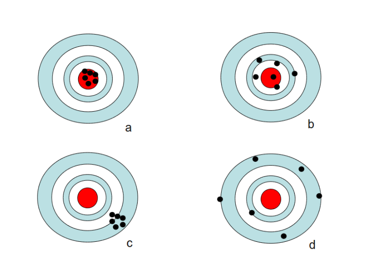

# Statistiques descriptives

Lorem ipsum dolor sit amet, an homero populo has. Ei petentium laboramus aliquando duo, an ius omnesque laboramus, vel in reque dicant impedit. Id magna quaestio vim, eu has possit verear. Nec tation repudiare ea, autem quodsi te vel, democritum definitiones ut quo. Dico posse ea sed, ridens iuvaret duo ea, nibh sonet sapientem vim at.

---

Le contenu théorique de chaque leçon est présenté dans un document comme celui-ci et intègre souvent du code en langage de programmation R. Nous sommes conscients que la convention en français est d'utiliser la virgule pour indiquer la décimale.
Toutefois, nous utilisons systématiquement le point pour désigner la décimale dans le texte. Ce choix vient du fait que la syntaxe de R utilise le point comme décimale - à la fois pour la saisie de valeurs numériques et pour l'affichage des sorties d'analyses. Ainsi, l'usage du point uniformisera le texte et nous sommes d'avis que cette décision facilitera sa compréhension.

---


###### À quoi servent les statistiques {-}

Les statistiques constituent une partie importante de la démarche scientifque. Elles s'appliquent à des domaines aussi variés que l'écologie, le génie, la psychologie, la médecine, et les sciences sociales. Les objectifs de l'analyse statistique sont les suivants :

 -	Estimer des paramètres. Par exemple, la question "Quel est le taux d'obésité au Québec ?" est un problème d'estimation. C'est-à-dire que nous cherchons à trouver la vraie valeur de cette densité.
 -	Tester des hypothèses. Par exemple, en posant la question "Les ours des aires protégées du Québec ont-ils une plus grande masse que leurs homologues à l'extérieur des aires protégées ?" Ici, nous voulons déterminer si la différence observée dans les deux groupes est due au hasard ou à un réel effet.
 -	Inférer les résultats dans un contexte plus général (où inférer signife "tirer des conclusions"). C'est ce que font, par exemple, régulièrement les maisons de sondage d'opinions politiques auprès de la population.
 -	Faire des prédictions. La prédiction consiste à construire un modèle et l'utiliser pour prédire le comportement d'une variable d'intérêt. On peut utiliser la prédiction en médecine, météorologie ou en toxicologie, par exemple. 
 
Définissons maintenant certains termes et concepts en statistique.

## Théories

### Paramètre vs statistique

Le **paramètre** est un concept important. Il désigne une valeur numérique inconnue qui caractérise une population d'intérêt. Par exemple, la taille moyenne en cm des résidents de l'île de Montréal est une valeur inconnue (mais qui existe). C'est-à-dire qu'il serait possible de calculer cette valeur si on mesurait chaque individu de cette région. Un paramètre est habituellement représenté par une lettre grecque ($\mu$, $\sigma$). Si la taille moyenne des résidents était de 1.91 m, on écrirait $\mu$ = 1.91 m. 

À l'opposé, une **statistique** est une quantité qui peut être calculée à partir des données d'un échantillon. Par exemple, si nous désirons calculer la taille moyenne des résidents de l'île de Montréal, nous pourrions le faire en mesurant la taille de 100 résidents de l'île. Une statistique est normalement désignée par une lettre romaine (s, sd, $\bar{x}$).

La **population statistique** est l'ensemble des éléments sur lesquels on veut baser nos conclusions (taille des résidents de Montréal). On ne connaît pas la taille moyenne des gens de cette population. Il existe deux options afin d'obtenir de l'information sur cette moyenne:

- mesurer la taille de chaque résident de Montréal (peu pratique et logistiquement difficile);
- utiliser un **échantillon** construit à partir de tailles d'individus sélectionnés aléatoirement dans la population de Montréal.

Pour faire une analogie, l'échantillon est à la population, ce que la statistique est au paramètre. Si nous poursuivons avec notre exemple d'échantillon de 100 résidents de Montréal (100 observations), la valeur numérique obtenue constituera une estimation de la taille moyenne ($\mu$) des résidents de Montréal. L'estimation est une valeur possible que peut prendre un paramètre. Pour récapituler, on infère sur la population à partir d'un échantillon. Si la moyenne de l'échantillon est de 1.7 m ($\bar{x}$ = 1.7 m), on peut dire que 1.7 est une estimation de la moyenne de la population $\mu$. Bref, on peut tirer des conclusions sur la population à partir d'un échantillon qui provient de cette même population.

Afin de faire une bonne estimation, l'échantillon doit être aléatoire et représentatif de la population. Dans un échantillon aléatoire, chaque élément de la population a une chance égale d'être inclus dans l'échantillon. Si on sélectionne aléatoirement 100 résidents de Montréal pour estimer la taille moyenne des individus dans la population et que, par malchance, tous les résidents sélectionnés proviennent du même quartier, l'échantillon ne sera pas représentatif de la population.

### Mesures de la tendance centrale

Certaines mesures décrivent la valeur autour de laquelle se concentrent la plupart des observations d'un échantillon ou d'une population. On parle alors de **tendance centrale** ou de **paramètres de position**. On peut estimer ces paramètres à partir d'un échantillon. La **moyenne arithmétique** est un exemple de ce genre de mesure:

$$
\bar{x} = \frac{\sum\limits_{i=1}^nx_i}{n}
$$

où $x_i$ correspond à la valeur $i$ de la variable $x$ et $n$ correspond au nombre d'observations. À noter que $\Sigma$ (la lettre grecque *sigma*) indique la somme de toutes les observations de $i = 1$ jusqu'à $n$. De façon plus générale, on appelle **estimateur** une formule ou équation utilisée pour estimer une certaine valeur, alors que l'estimation est le résultat de l'estimateur.

---

**Exemple 1.1** Lors d'une expérience sur la hauteur de semis sur un sol argileux après une saison de croissance, on obtient les valeurs suivantes en cm: 12.3, 4.2, 5.9, 9.1, 3.3, 5.1, 7.3, 3.8, 8.0, 6.1. Le calcul de la moyenne arithmétique se fait comme suit:

$$
\bar{x} = \frac{\sum\limits_{i=1}^nx_i}{n} = \frac{12.3 + 4.2 + 5.9 +  \ldots + 8.0 + 6.1}{10} \\
\bar{x} = 6.51 
$$

<!-- je n'arrive pas à mettre les calculs dans les équations ci-dessus comme dans le texte ci-dessous pour afficher le résultat 6.51 -->
Ainsi, la moyenne arithmétique de cet échantillon est de `r round(mean(c(12.3, 4.2, 5.9, 9.1, 3.3, 5.1, 7.3, 3.8, 8.0, 6.1)), digits = 2) ` cm.

---

L'estimateur de $\bar{x}$ est un estimateur non-biaisé de $\mu$ si:

- les observations sont effectuées sur des individus sélectionnés aléatoirement;
- les observations sont indépendantes;
- les observations de la variable décrivant la population suivent une distribution normale.

La **moyenne géométrique** est une autre mesure de tendance centrale, particulièrement appropriée pour décrire des processus multiplicatifs[^1]. Un processus multiplicatif est un effet qui ou en présence de valeurs extrêmes:

$$
\bar{x}_{g\acute{e}om} = \sqrt[n]{\prod_{i=1}^n x_i} \\
\bar{x}_{g\acute{e}om} = e^\frac{{\sum\limits_{i=1}^n \log(x_i)}}{n}
$$

---

**Exemple 1.2** Disons qu'après un décompte d'insectes sur 5 quadrats[^2] dans un champ agricole, on observe les abondances suivantes: 10, 1, 1000, 1, 10.

$$
\bar{x}_{g\acute{e}om} = \sqrt[5]{10 \cdot 1 \cdot 1000 \cdot 1 \cdot 10} \\
\bar{x}_{g\acute{e}om} = 10
$$
La moyenne géométrique de ces valeurs nous donne 10, alors que la moyenne arithmétique nous donne 204.4. La valeur 1000 se démarque nettement des autres et exerce une influence démesurée sur la moyenne arithmétique, et dans ce cas, la moyenne géométrique est un meilleur estimateur de la tendance centrale.

---

La **moyenne harmonique** peut s'appliquer à des taux (p. ex., vitesses):

$$
\bar{x}_{harm} = \frac{n}{\sum\limits_{i=1}^n \frac{1}{x_i}}
$$

---

**Exemple 1.3** Par exemple, disons que nous avons suivi un ours noir par télémétrie. L'ours a parcouru un segment de 2 km à une vitesse de 1 km/h, un deuxième segment de 2 km à une vitesse de 2 km/h, un troisième segment de 2 km à une vitesse de 4 km/h et un dernier segment de 2 km à une vitesse de 1 km/h. Quelle est la vitesse moyenne de l'ours?

On pourrait utiliser la moyenne harmonique pour résoudre le problème. Sachant que $vitesse = distance/temps$, nous pouvons déterminer la distance totale parcourue: $4 * 2 \: \mathrm{km} = 8 \:\mathrm{km}$. On peut ensuite évaluer le temps mis à parcourir ces 8 km:

- 1$^{\mathrm{er}}$ segment: 2 km * 1h/km = 2 h
- 2$^{\mathrm{e}}$ segment: 2 km * 1h/2 km = 1 h
- 3$^{\mathrm{e}}$ segment: 2 km * 1h/4 km = 0.5 h
- 4$^{\mathrm{e}}$ segment: 2 km * 1h/1 km = 2 h

Le temps total est 5.5 h. Nous pouvons calculer la vitesse moyenne:

$$
\mathrm{vitesse \:moyenne} = 8 \:\mathrm{km}/5.5 \:\mathrm{h} \\
\mathrm{vitesse \:moyenne} = 1.45 \:\mathrm{km/h}
$$
C'est exactement ce que nous donne la moyenne harmonique:

$$
\bar{x}_{harm} = \frac{4}{1/1 + 1/2 + 1/4 + 1/1} \\
\bar{x}_{harm} = 1.45
$$

---

À noter que la moyenne harmonique s'applique à des vitesses si elles sont mesurées sur une même distance. Si les distances diffèrent, nous devrons utiliser une version pondérée de la moyenne harmonique.

Les trois types de moyennes sont reliées par la relation suivante:

$$
\bar{x}_{harmonique} < \bar{x}_{g\acute{e}om} < \bar{x}
$$

Si les observations sont égales ($x_1 = x_2 = x_3 \ldots = x_n$), nous obtenons:

$$
\bar{x}_{harmonique} = \bar{x}_{g\acute{e}om} = \bar{x}
$$

Il existe d'autres mesures de tendance centrale, notamment la **médiane** qui se définit comme étant la valeur qui sépare les observations en deux groupes égaux (50 \% des valeurs < médiane, 50 \% des valeurs > médiane). En présence de données normales, la médiane et la moyenne sont proches. La médiane est peu influencée par la présence de valeurs extrêmes (valeurs très grandes ou très faibles), alors que la moyenne est très sensible à la présence de valeurs extrêmes.

---

**Exemple 1.4** Dans une expérience sur le temps de survie d'insectes exposés à un insecticide, on obtient les valeurs (en secondes) 1.1, 1.2, 1.3, 1.6, 3.2, 2.4, 5.2. La moyenne arithmétique de cet échantillon est de `r round(mean(c(1.1, 1.2, 1.3, 1.6, 3.2, 2.4, 5.2)), digits = 2)` secondes et la médiane est de `r round(median(c(1.1, 1.2, 1.3, 1.6, 3.2, 2.4, 5.2)), digits = 2)` secondes. Si l'on ajoute une dernière observation dont la valeur extrême est 40 secondes, la moyenne arithmétique sera alors de `r round(mean(c(1.1, 1.2, 1.3, 1.6, 3.2, 2.4, 5.2, 40)) , digits = 2)` secondes et la médiane de `r round(median(c(1.1, 1.2, 1.3, 1.6, 3.2, 2.4, 5.2, 40)), digits = 2)` secondes. On constate que la médiane est beaucoup moins sensible à l'ajout de la valeur extrême, ce qui n'est pas le cas de la moyenne arithmétique.

---

```{r histomode, echo=FALSE, fig.cap="Histogramme illustrant une distribution unimodale (a) et bimodale (b)."}
##mode
xmod <- c(1, 3, 4, 5, 6, 8, 8, 8, 8, 8, 8, 8, 9, 1, 3, 4, 
          6, 8, 10, 1, 12, 13, 10)
par(mfrow = c(1, 2), cex = 1.2)
hist(xmod, breaks = 10, main = "Mode = 8", 
     ylab = "Fréquences", xlab = "Valeurs de x", col = "turquoise")
##add text
text(x = 1, y = 7.8, labels = expression(bold(a)), 
     cex = 1.2)
xmod2 <- c(1, 3, 4, 5, 6, 8, 8, 8, 8, 8, 8, 8, 9, 1, 3, 4, 
           6, 8, 10, 1, 12, 13, 10, 15, 16, 16, 11, 16, 16,
           14, 15, 16, 16, 18)
hist(xmod2, breaks = 18, main = "Mode = 8 et mode = 16", 
     ylab = "Fréquences", xlab = "Valeurs de x",
     col = "turquoise")
text(x = 1, y = 7.8, labels = expression(bold(b)),
     cex = 1.2)
```

Le **mode** permet aussi de caractériser la tendance centrale, car il donne la ou les valeurs qui reviennent le plus souvent dans l'échantillon (Figure \@ref(fig:histomode)). Par exemple, si, dans un échantillon, on obtient les valeurs 12, 12, 12, 12, 12, 3, 3, 3, 3, 3, 3, 1, 2, 14, 15, 16, 21, 32, on dira qu'il y a deux modes (12 et 3).

### Mesures de dispersion

Certaines mesures décrivent plutôt l'étendue de la variabilité des données. On parle alors de **mesures de dispersion** ou de **paramètres de variabilité**. Plus la variabilité augmente, plus l'incertitude quant à la valeur des paramètres estimés à partir de données d'un échantillon augmente. Un niveau d'incertitude plus élevé augmente la difficulté de trouver des différences et de tester des hypothèses. L'**étendue** (*range*) est la mesure  de dispersion la plus simple. Il s'agit de la différence entre la valeur minimale et la valeur maximale des observations.

#### Somme des carrés des erreurs

La **somme des carrés des erreurs** (*sum of squared errors, SSE*) donne le carré de la différence entre chaque observation et la moyenne de l'échantillon:

$$
SSE = \sum_{i=1}^n (x_i - \bar{x})^2
$$

Cette mesure de variabilité est l'une des plus communes, et peut prendre des valeurs ≥≥ 0 (le carré assure des valeurs positives). Plus cette valeur est grande, plus il y a de variabilité dans les données (i.e., les observations sont plus éloignées de la moyenne).

---

**Exemple 1.5** Un échantillon de 6 longueurs de tige d'une plante ligneuse donne 1.3 m, 4.5 m, 4.1 m, 2.1 m, 5.0 m, et 1.9 m, il s'ensuivra que $$\bar{x}$$ = 3.15 m et que $$SSE=(1.3−3.15)2+(4.5−3.15)2+…+(1.9−3.15)2=12.24m^2$$. Une propriété importante de la SSE est qu'à chaque nouvelle observation ajoutée, elle augmente (pourvu que $$x_{nouvelle}\neq \bar{x}$$). Si on ajoute une septième valeur de 2.6 à notre échantillon de longueurs de tige présenté ci-haut, la moyenne arithmétique devient 3.07 et la SSE s'élèvera à 12.49 $$m^2$$.

---

Une meilleure mesure de dispersion devrait tenir compte de la taille de l'échantillon. Mais avant d'aller plus loin, allons visiter le concept de degrés de liberté (*degrees of freedom, df*), un concept souvent nébuleux que nous tenterons d'éclaircir ici. On peut voir les degrés de liberté comme étant la taille de l'échantillon corrigée pour le nombre de paramètres estimés.On peut obtenir cette valeur en soustrayant le nombre de paramètres estimés p de la taille d'échantillon n (*i.e., n − p*). Clarifions avec un exemple.

---

**Exemple 1.6** Imaginez qu'on ait un échantillon de 5 observations dont on ne connait rien. Ces 5 observations pourraient prendre n'importe quelle valeur. Le degré de liberté est donc 5 (*df* = 5). Imaginez maintenant qu'on connaisse un paramètre de cet échantillon (p. ex., $$\bar{x}$$ = 7). On réduit la liberté des valeurs que peuvent prendre ces 5 observations. En effet, disons que les valeurs aient été ndéterminées pour 4 des observations et que la moyenne est connue, la dernière observation est obligée de prendre une valeur en particulier. Avec un paramètre connu, le degré de liberté est donc 4 (*df* = 5 − 1 = 4).

---

#### Carré moyen (variance)

Comme nous l'avons mentionné plus tôt, la somme des carrés des erreurs ($SSE$) augmente avec la taille de l'échantillon. Une meilleure mesure devrait tenir compte de la taille d'échantillon. Le **carré moyen**(*mean square, mean squared error, MSE*) est une telle mesure de dispersion :

$$
MSE = \frac{SSE}{df} = \frac{\sum\limits_{i=1}^n (x_i - \bar{x})^2}{n - 1}
$$
À noter que le dénominateur correspond aux degrés de liberté, ici $n - 1$, puisque nous avons estimé la moyenne arithmétique $\mu$ à l'aide de $\bar{x}$ pour trouver la $SSE$. Ce carré moyen est en fait la **variance** de l'échantillon, $s^2 = MSE$. Cette relation est importante et nous reviendrons sur cette notion lors de la leçon sur l'analyse de variance. On peut donc estimer la variance de la population à partir d'un échantillon en utilisant l'équation : 

$$
s^2 = MSE = \frac{SSE}{df} \\
s^2 = \frac{\sum\limits_{i=1}^n (x_i - \bar{x})^2}{n - 1}
$$
Parfois, on utilise aussi la formule alternative (mais totalement équivalente):

$$
s^2 = \frac{\sum\limits_{i=1}^n x_i^2 - \frac{\left (\sum\limits_{i=1}^n x_i\right )^2}{n}}{n - 1}
$$
L'**écart-type** ($s$) est simplement la racine carrée de la variance, et il indique la variabilité dans les données. La variance dépend énormément de la taille de l'échantillon. L'estimation devient difficile lorsqu'on a peu d'observations dans l'échantillon. Illustrons avec un exemple.  

---

**Exemple 1.7** Utilisons une petite simulation à l'aide de **R** pour générer des données provenant d'une population avec des caractéristiques connues, soit une population normale avec une moyenne de 10.1 ($\mu = 10.1$) et une variance de 4 ($\sigma^2 = 4$). Nous allons sélectionner aléatoirement trois observations provenant de cette population afin de constituer un échantillon de $n = 3$. 

À partir de cet échantillon, nous pouvons calculer une variance qui sera une estimation de la vraie valeur. Nous estimerons $\sigma$ à l'aide de l'estimateur de la variance ($s$) d'un échantillon. Afin d'obtenir une meilleure idée de la performance de l'estimation de la variance, nous allons ensuite répéter l'exercice pour 29 autres échantillons de $n = 3$ tirés de la même population, et calculer la variance de chaque échantillon de taille 3. Par la suite, nous ferons de même pour 30 échantillons constitués de 4 observations, 30 échantillons de 5 observations, ..., 30 échantillons de 49 observations et 30 échantillons de 50 observations (fig. \ref{Figure:variance}). 

On remarque que l'estimation de la variance est parfois très loin de la vraie valeur de 4, particulièrement pour les très petits échantillons ($n \leq 10$). On obtient de meilleures estimations pour de plus grands échantillons, particulièrement au-delà de 30. C'est une des raisons pour laquelle on considère un échantillon de 30 observations comme ayant une taille suffisante -- il permet de bien estimer la variance. On comprend rapidement que l'utilisation d'un petit échantillon peut nous amener loin de la vraie valeur de la variance. Mais pourquoi s'intéresser autant à la variance?

```{r variance, echo=FALSE, fig.cap="Effet du nombre d'observations sur l'estimation de la variance. À noter que la ligne pointillée représente la vraie valeur de la population ($\\sigma^2 = 4$) à partir de laquelle les observations ont été sélectionnées aléatoirement"}
##Sample size and variance
plot(x = c(0, 52), y = c(0, 20), type = "n", 
     xlab = "Taille de l'échantillon (n)", ylab = expression(paste("Variance estimée (", sigma^2, ")")))

##try scenarios with sample sizes of 3 to 50 observations
for (df in 3:50) {          
  ##obtain 30 data sets for each scenario
  for (i in 1:50){            
    #obtain sample of size df with mean and sd
    x <- rnorm(df, mean = 10.1, sd = 2) 
    points(df, var(x))           #plot the points on graph
  }
}
abline(h = 4, lty = 2, lwd = 3, col = "blue") #add line to indicate variance
```

---

La variance est une quantité importante en statistiques, puisqu'elle est requise pour construire des mesures de précision (p. ex., intervalles de confiance) et pour tester des hypothèses (p. ex., test t). Un petit échantillon peut produire une estimation très loin de la vraie valeur de la variance et invalider les conclusions d'une analyse statistique. Tel qu'illustré dans l'exemple 1.7, l'estimation de la variance s'améliore avec la taille de l'échantillon. Ce qui nous mène à visiter les concepts de **précision** et d'**exactitude**.


#### Précision vs exactitude

La réalisation d'une expérience, impliquant l'échantillonnage des observations et l'estimation des quantités, s'apparente à un archer qui lance une flèche sur une cible, où la flèche correspond à une expérience et le point sur la cible correspond à une estimation. On veut que la flèche se rende le plus près du centre de la cible (c.-à-d., une bonne estimation), mais on veut que les flèches ne soient pas trop éloignées les unes des autres (c.-à-d., une bonne précision). En d'autres termes, un archer est précis si toutes ses flèches tombent très près du même point sur la cible (fig. \ref{Figure:accuracy}a, c), ou encore il peut manquer d'exactitude lorsque ses flèches sont loin du centre de la cible (fig. \ref{Figure:accuracy}c, d). Le meilleur des scénarios est un tir précis et exact (fig. \ref{Figure:accuracy}a), et le pire est un tir ni précis, ni exact (fig. \ref{Figure:accuracy}d). Le tir exact mais peu précis implique que l'estimation varie beaucoup d'un échantillon à l'autre (fig. \ref{Figure:accuracy}b), et cette variation n'est pas souhaitable. 


```{r accuracy, fig.align='left', echo=FALSE, fig.link='Module_1/images/Target3.png', fig.cap="Utilisation de cibles pour expliquer le concept de précision et d'exactitude avec quatre archers dans une compétition. Si tous les points se trouvent au centre et très près les uns des autres, l'archer est précis et exact (a), alors que si les points sont dans la région centrale mais éloignés les uns des autres, l'archer est exact mais peu précis (b). À l'opposé, si les points sont très près les uns des autres et loin du centre, l'archer est précis mais manque d'exactitude (c), tandis que dans le dernier scénario l'archer n'est ni précis ni exact (d)."}

```


#### Autres mesures de dispersion

## Introduction à R

## Exercices et corrections